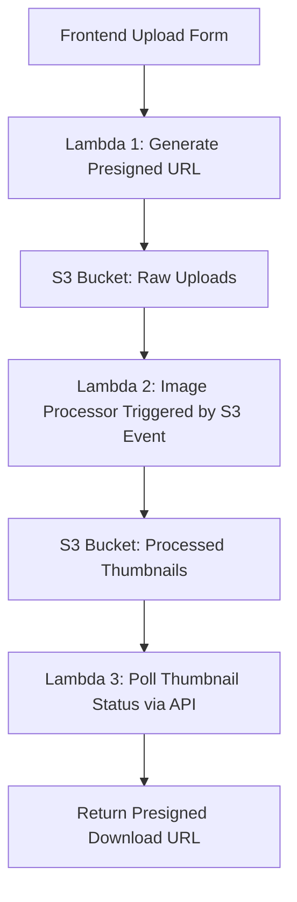

# 📸 S3-Based Thumbnail Generator (Serverless)

A fully serverless tool that turns uploaded images into ready-to-go YouTube thumbnails—automatically. Users upload an image and optional text via a simple web interface, and behind the scenes, AWS Lambda + S3 + API Gateway do all the magic.

---

## ⚡️ Features

- ✨ Upload images directly to S3 via presigned URLs
- 🧠 Automatically processes images using Pillow in a Lambda function
- 🔤 Overlays custom text with automatic contrast enhancement
- 📌 Generates a YouTube-ready thumbnail in seconds
- 🔁 Polls backend to check when the thumbnail is ready
- 🖼️ Returns a presigned download URL for the final image

---

## 🧱 Architecture



---

## 🛠️ Tech Stack

- AWS Lambda
- Amazon S3
- Amazon API Gateway
- Python (Pillow for image processing)
- HTML + JavaScript frontend

---

## 🚀 Getting Started

### 1. Clone the repo

```bash
git clone https://github.com/your-username/thumbnail-generator.git
cd thumbnail-generator
```

### 2. Set up your AWS resources

- Create **three S3 buckets**:
  - One for raw uploads
  - One for processed thumbnails
  - One for the static website
- Deploy three Lambda functions:
  - `thumbnail-presignedposturl-lambda`: Returns a PUT URL for uploads
  - `thumbnail-process-lambda`: Triggered by uploads, overlays text, saves processed image
  - `thumbnail-polling-lambda`: Polls processed bucket and returns a presigned GET URL

### 3. IAM Permissions

Each Lambda function needs specific IAM permissions:
- `thumbnail-presignedposturl-lambda`: `s3:PutObject` for raw bucket
- `thumbnail-process-lambda`: `s3:GetObject`, `s3:PutObject` for both buckets
- `thumbnail-polling-lambda`: `s3:GetObject` on processed bucket (for `head_object()`)

---

## 🖥️ Frontend Usage

- Simple HTML form with file and text inputs
- Fetches presigned URL → uploads to S3 → polls backend for result

```html
<form id="upload-form">
    <label for="text">Thumbnail Text:</label>
    <input type="text" id="text" name="text" required />

    <label for="filetype">File Type (jpeg or png):</label>
    <select id="filetype" name="filetype">
      <option value="jpeg">JPEG</option>
      <option value="png">PNG</option>
    </select>

    <label for="image">Select Image:</label>
    <input type="file" id="image" name="image" accept=".jpg,.jpeg,.png" required />

    <button type="submit">Generate Thumbnail</button>
  </form>
```

---

## 📸 Example Output

> 


---

## 📄 License

MIT License. Go wild.

---

## 🙌 Acknowledgments

Built with caffeine, memes, and a desire to never manually resize a YouTube thumbnail again.

```

---

Let me know if you want a styled badge section, deployment instructions using SAM or Terraform, or to embed your Medium article when it's done!
